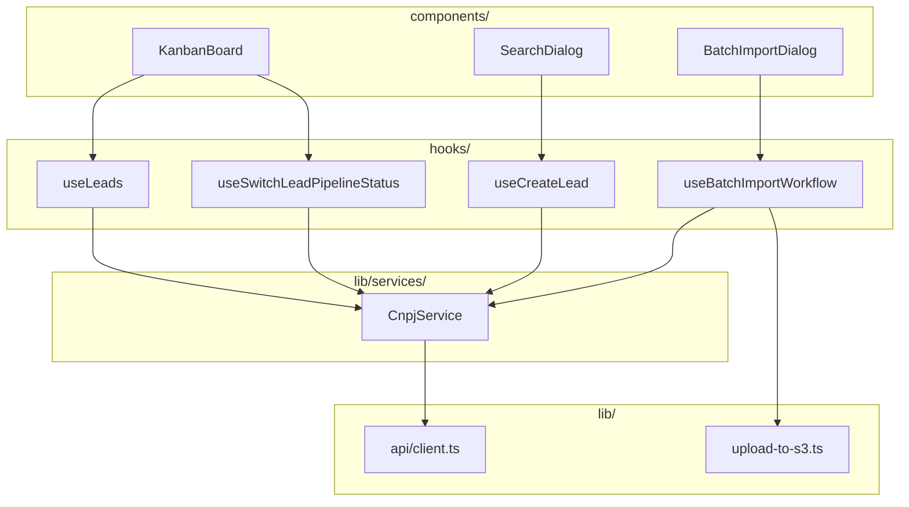
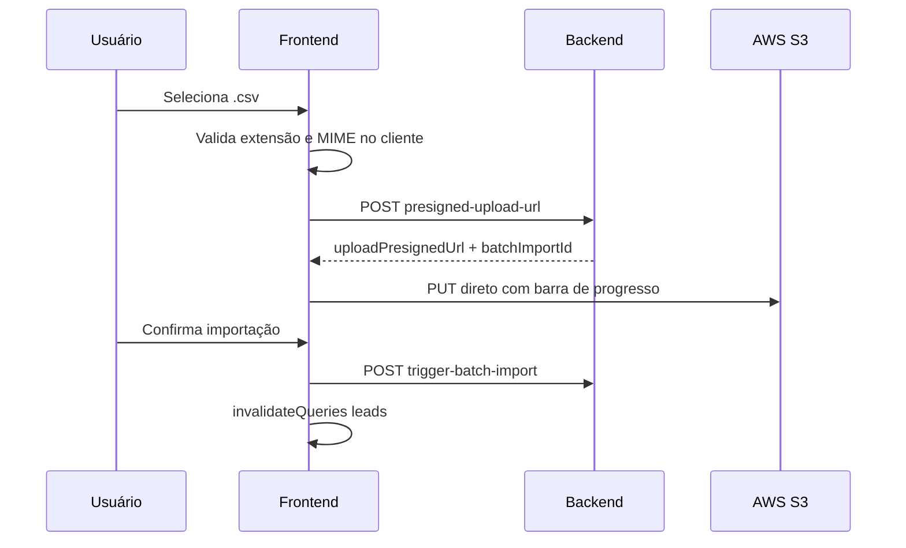

# letalk — Frontend (Desafio Técnico)

Interface Next.js para consulta e enriquecimento de CNPJs, pipeline Kanban de leads e importação em lote via CSV. Consome a API backend em `http://localhost:3001/api/v1` (Fastify).

**Stack:** Next.js 16 (App Router) · React 19 · TypeScript · TanStack Query · `@dnd-kit` · Tailwind CSS · shadcn/ui · Axios

---

## Pré-requisitos

- [Node.js](https://nodejs.org/) 20+ (LTS recomendado)
- npm
- API backend rodando (porta 3001)

---

## Instalação e Execução Local

```bash
npm install
npm run dev
```

A aplicação estará em **http://localhost:3000**.

Configure `NEXT_PUBLIC_API_URL=http://localhost:3001/api/v1` se a API não estiver no default (valor padrão em `lib/api/client.ts`).

### Produção

```bash
npm run build
npm run start
```

---

## Stack — React, TypeScript e Next.js

O desafio pedia **React com TypeScript**. Optei por **Next.js** — framework React que traz consigo roteamento (App Router), metadata/SSR, estrutura de projeto e ferramental para aplicações full-stack — em vez de montar um SPA React do zero. A escolha mantém o requisito técnico e acelera a organização do código sem adicionar complexidade desnecessária.

---

## Estrutura — `components → hooks → service`

A organização segue um fluxo unidirecional: componentes de UI consomem hooks que encapsulam React Query; hooks delegam chamadas HTTP ao service layer.

```
frontend/
├── app/                         # App Router (layout, page principal)
├── components/                  # UI de domínio + components/ui/ (shadcn)
├── hooks/                       # 1 hook ≈ 1 operação de domínio
└── lib/
    ├── api/client.ts            # Axios + ApiError
    ├── services/cnpj-service.ts # Único service de domínio
    ├── query-keys.ts            # Chaves de cache
    ├── upload-to-s3.ts          # PUT direto no S3
    └── types.ts                 # Tipos + KANBAN_COLUMNS
```

| Camada | Responsabilidade | Exemplos |
|--------|------------------|----------|
| `components/` | UI de domínio e composição | `kanban-board.tsx`, `search-dialog.tsx`, `batch-import-dialog.tsx` |
| `hooks/` | Estado remoto, cache e side effects | `use-leads.ts`, `use-create-lead.ts`, `use-batch-import-workflow.ts` |
| `lib/services/` | Chamadas HTTP tipadas | `cnpj-service.ts` |
| `lib/` | Infra compartilhada | `api/client.ts`, `query-keys.ts`, `upload-to-s3.ts`, `types.ts` |



---

## Kanban — pipeline de validação e análise

O requisito central do desafio era:

> *"Com essas informações, o objetivo é enriquecer o lead com dados mais estratégicos para análise e priorização."*

Após a consulta de CNPJ (Brasil API), o lead chega **enriquecido** — razão social, CNAEs, sócios, regime tributário, capital social, entre outros. A interface precisava materializar esse enriquecimento em um fluxo de **análise e priorização** acessível ao usuário.

Escolhi o modelo **Kanban** porque, pela minha experiência em projetos full-stack, é uma forma simples, visual e coesa de organizar etapas de validação — cada coluna representa um estágio de decisão comercial, sem over-engineering.

O board mapeia `PipelineStatus` em 4 colunas ([`lib/types.ts`](lib/types.ts)):

| Status | Coluna | Papel no pipeline |
|--------|--------|-------------------|
| `PENDING` | Pendente | Entrada — lead recém-enriquecido aguardando triagem |
| `IN_REVIEW` | Em Análise | Análise ativa dos dados estratégicos |
| `QUALIFIED` | Qualificado | Lead aprovado para prospecção |
| `REJECTED` | Rejeitado | Lead descartado |

**Prioridade** (`LOW` / `MEDIUM` / `HIGH`) funciona como eixo ortogonal às colunas — reflete a priorização pedida no requisito, exibida nos cards sem ocupar uma dimensão extra no board.

**Fluxo do usuário:**

1. Busca CNPJ → preview enriquecido → cria lead com status e prioridade iniciais.
2. Lead aparece no Kanban → usuário arrasta entre colunas conforme a análise evolui.
3. Importação em lote alimenta a coluna `PENDING` (backend fixa status inicial em `PENDING` + `LOW`).

A movimentação entre colunas usa drag-and-drop (`@dnd-kit`) e dispara `PATCH /cnpj/leads/:id/pipeline-status` via `useSwitchLeadPipelineStatus`, com **optimistic update** para manter a UI responsiva.

---

## React Query (TanStack Query)

O estado remoto fica isolado da UI via **TanStack Query**. O provider ([`components/providers.tsx`](components/providers.tsx)) define defaults globais: `staleTime: 30s`, `refetchOnWindowFocus: false`, `retry: 1` (queries) e `retry: 0` (mutations).

Chaves centralizadas em [`lib/query-keys.ts`](lib/query-keys.ts):

| Hook | Tipo | Estratégia de cache |
|------|------|---------------------|
| `useLeads` | Query | Lista com filtros; chave `['leads', 'list', filters]` |
| `useCnpjLookup` | Mutation | Sem cache persistente |
| `useCreateLead` | Mutation | `invalidateQueries(leads.all)` |
| `useDeleteLead` | Mutation | Optimistic remove + invalidate |
| `useSwitchLeadPipelineStatus` | Mutation | Optimistic update no Kanban |
| `useBatchImportWorkflow` | Mutations encadeadas | Invalidate após trigger bem-sucedido |

Essa separação mantém componentes enxutos, o Kanban responsivo durante PATCH/DELETE e a lista de leads consistente após mutações que alteram o estado global.

---

## Upload CSV — presigned URLs e processamento no cliente

Sempre que possível, o processamento pesado fica **fora do backend** — o arquivo CSV **não trafega pela API**; o browser faz upload direto ao S3 via presigned URL, e o backend só recebe metadados e o trigger de importação.



**Fluxo em 3 etapas** (wizard em [`components/batch-import-dialog.tsx`](components/batch-import-dialog.tsx)):

1. **Selecionar** — validação de extensão `.csv` e MIME no cliente (`hooks/use-batch-import-workflow.ts`).
2. **Enviar** — `POST /cnpj/batch-imports/presigned-upload-url` → `PUT` direto no S3 via [`lib/upload-to-s3.ts`](lib/upload-to-s3.ts) com progresso 0→100.
3. **Importar** — `POST /cnpj/trigger-batch-import` → invalidação do cache de leads.

A máquina de estados do workflow cobre `idle → selected → uploading → uploaded → triggering → done` (com estados de erro e cancelamento). Ao fechar o dialog, `abortIfPending` tenta cancelar importações pendentes via `DELETE /cnpj/batch-imports/:batchImportId`.

---

Projeto desenvolvido com dedicação.

Contato: guirramatheus1@gmail.com | [LinkedIn](https://linkedin.com/in/guirra-byte) | +55 (61) 99283-9756
